# 结果分析报告

## 1. 报告说明

- 样本区间：`2015-01-05` 至 `2023-12-29`。
- 样本范围：沪深300成分股日频截面，每个交易日固定 `300` 只股票。
- 回测口径：单因子 IC 分析 + 十分位分组回测。
- IC 滞后期：`1/5/10/20` 个交易日。
- 分组方式：按因子值从低到高分为 `10` 组，重点观察 `G1`、`G10` 与 `LS_Gn_G1`。
- 数据说明：以下因子名中的 `clip3` 均表示经过横截面 `3 sigma` 截尾处理。

## 2. 优先关注因子概览

| 因子 | 1日IC均值 | 1日ICIR | 20日IC均值 | 多空日均收益 | 多空IR | 多空累计收益 |
| --- | ---: | ---: | ---: | ---: | ---: | ---: |
| 20日动量因子 | -0.0199 | -1.4662 | -0.0298 | 0.000135 | 0.1193 | -0.0570 |
| 20日波动率因子 | -0.0258 | -1.7905 | -0.0511 | 0.000074 | 0.0608 | -0.2169 |
| ROE因子 | 0.0043 | 0.4226 | 0.0219 | 0.000220 | 0.2932 | 0.3849 |
| 对数市值因子 | 0.0050 | 0.4308 | 0.0178 | -0.000531 | -0.4989 | -0.7739 |
| 20日换手率代理因子 | -0.0237 | -1.7204 | -0.0596 | -0.000330 | -0.2855 | -0.6648 |

## 3. 优先关注因子详细结果

### 1. 20日动量因子 `momentum_20_raw_clip3`

- 因子含义/计算方法：过去20个交易日收盘价涨跌幅，计算口径为 `ClosePrice.pct_change(20)`；`clip3` 表示横截面3 sigma截尾后结果。
- IC分析：1日 IC 均值为 `-0.0199`，1日 ICIR 为 `-1.4662`，20日 IC 均值为 `-0.0298`。当前 1日 IC 方向为`负`。
- 十分位回测：`LS_Gn_G1` 日均收益 `0.000135`，IR `0.1193`，累计收益 `-0.0570`。当前多空累计收益方向为`负`。
结果文件地址：
- IC序列：`Factor_test/data/metrics/momentum_20_raw_clip3/ic_series.csv`
- IC衰减统计：`Factor_test/data/metrics/momentum_20_raw_clip3/ic_decay.csv`
- 分组收益统计表：`Factor_test/data/metrics/momentum_20_raw_clip3/group_returns_stats.csv`
- 因子分布统计表：`Factor_test/data/metrics/momentum_20_raw_clip3/factor_distribution_stats.csv`

IC衰减核心数据：

| 滞后期 | 样本数 | IC均值 | ICIR | 正IC占比 |
| --- | ---: | ---: | ---: | ---: |
| 1d | 2188 | -0.0199 | -1.4662 | 46.57% |
| 5d | 2184 | -0.0195 | -0.6738 | 46.61% |
| 10d | 2179 | -0.0187 | -0.4659 | 47.32% |
| 20d | 2169 | -0.0298 | -0.5422 | 45.87% |

分组收益核心数据：

| 组别 | 样本数 | 日均收益 | IR | 胜率 | 最大回撤 | 累计收益 |
| --- | ---: | ---: | ---: | ---: | ---: | ---: |
| G1 | 2188 | -0.000022 | -0.0181 | 49.82% | -0.6724 | -0.3616 |
| G10 | 2188 | 0.000113 | 0.1003 | 50.96% | -0.7026 | -0.0990 |
| LS_Gn_G1 | 2188 | 0.000135 | 0.1193 | 50.37% | -0.5917 | -0.0570 |

因子分布核心数据：

| 样本量 | 均值 | 标准差 | P5 | 中位数 | P95 | 偏度 | 峰度 |
| ---: | ---: | ---: | ---: | ---: | ---: | ---: | ---: |
| 656700 | 0.0025 | 0.1159 | -0.1680 | -0.0029 | 0.1966 | 0.8420 | 5.9150 |

IC衰减曲线：

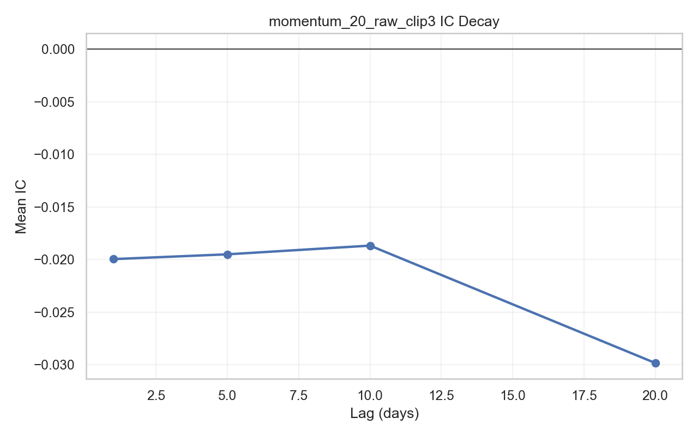

因子分布直方图：

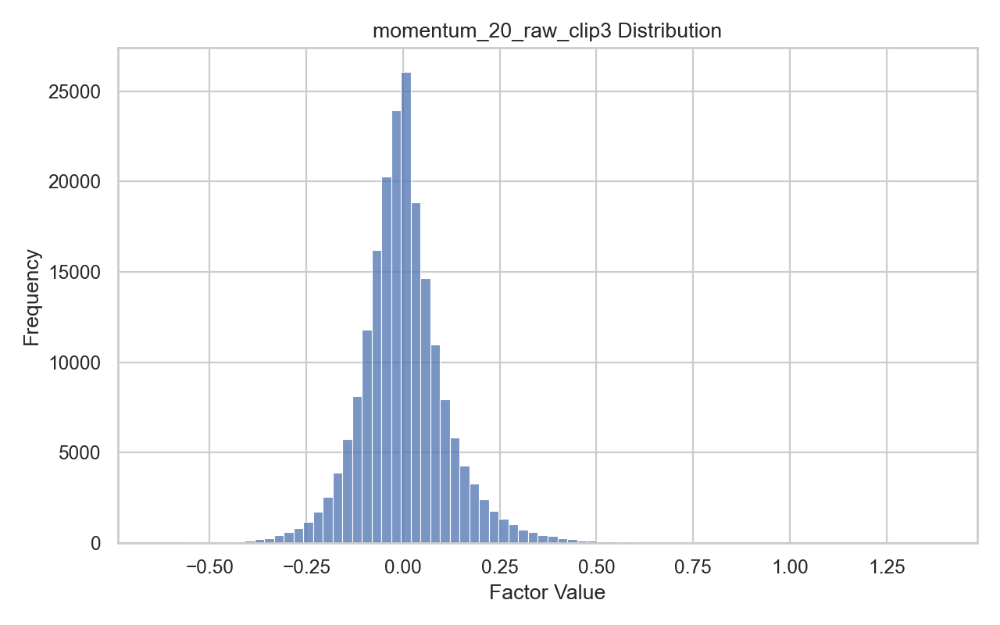

分组收益热力图：

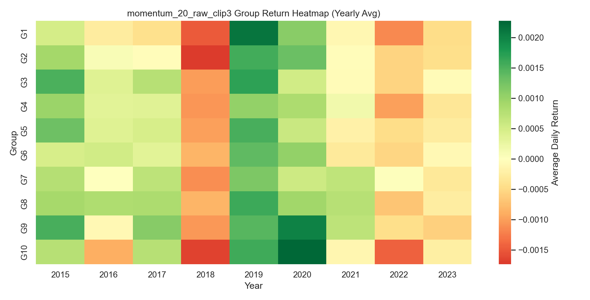

### 2. 20日波动率因子 `volatility_20_raw_clip3`

- 因子含义/计算方法：过去20个交易日日收益率标准差，计算口径为 `std(ret_1d, 20)`；`clip3` 表示横截面3 sigma截尾后结果。
- IC分析：1日 IC 均值为 `-0.0258`，1日 ICIR 为 `-1.7905`，20日 IC 均值为 `-0.0511`。当前 1日 IC 方向为`负`。
- 十分位回测：`LS_Gn_G1` 日均收益 `0.000074`，IR `0.0608`，累计收益 `-0.2169`。当前多空累计收益方向为`负`。
结果文件地址：
- IC序列：`Factor_test/data/metrics/volatility_20_raw_clip3/ic_series.csv`
- IC衰减统计：`Factor_test/data/metrics/volatility_20_raw_clip3/ic_decay.csv`
- 分组收益统计表：`Factor_test/data/metrics/volatility_20_raw_clip3/group_returns_stats.csv`
- 因子分布统计表：`Factor_test/data/metrics/volatility_20_raw_clip3/factor_distribution_stats.csv`

IC衰减核心数据：

| 滞后期 | 样本数 | IC均值 | ICIR | 正IC占比 |
| --- | ---: | ---: | ---: | ---: |
| 1d | 2188 | -0.0258 | -1.7905 | 44.24% |
| 5d | 2184 | -0.0375 | -1.2027 | 42.72% |
| 10d | 2179 | -0.0432 | -0.9993 | 41.81% |
| 20d | 2169 | -0.0511 | -0.8216 | 42.00% |

分组收益核心数据：

| 组别 | 样本数 | 日均收益 | IR | 胜率 | 最大回撤 | 累计收益 |
| --- | ---: | ---: | ---: | ---: | ---: | ---: |
| G1 | 2188 | 0.000361 | 0.6673 | 50.55% | -0.2483 | 1.0329 |
| G10 | 2188 | 0.000435 | 0.3110 | 51.74% | -0.6225 | 0.5140 |
| LS_Gn_G1 | 2188 | 0.000074 | 0.0608 | 50.59% | -0.5899 | -0.2169 |

因子分布核心数据：

| 样本量 | 均值 | 标准差 | P5 | 中位数 | P95 | 偏度 | 峰度 |
| ---: | ---: | ---: | ---: | ---: | ---: | ---: | ---: |
| 656700 | 0.0229 | 0.0130 | 0.0077 | 0.0206 | 0.0454 | 3.1898 | 43.0014 |

IC衰减曲线：

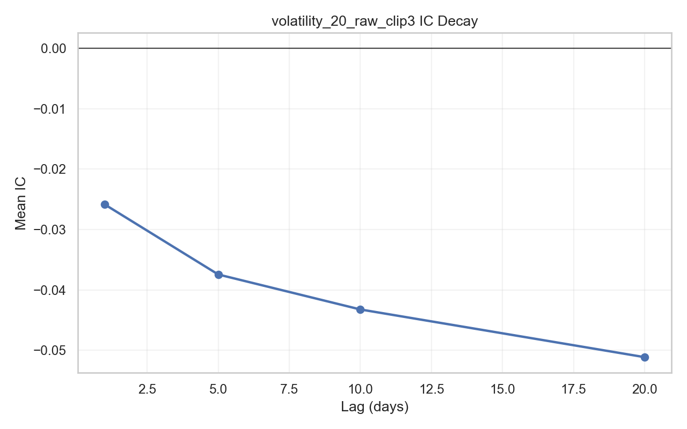

因子分布直方图：

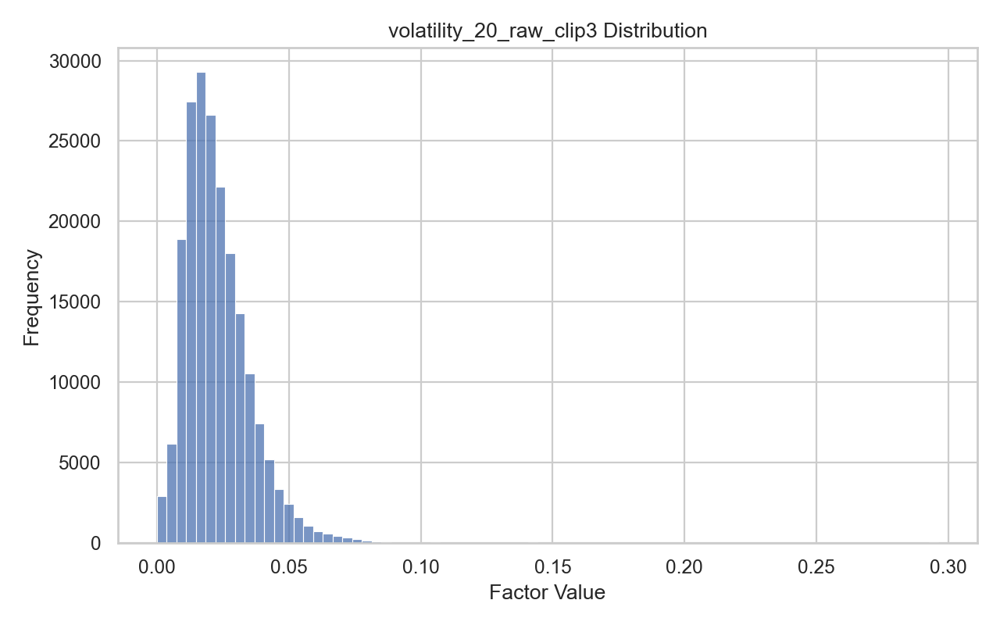

分组收益热力图：

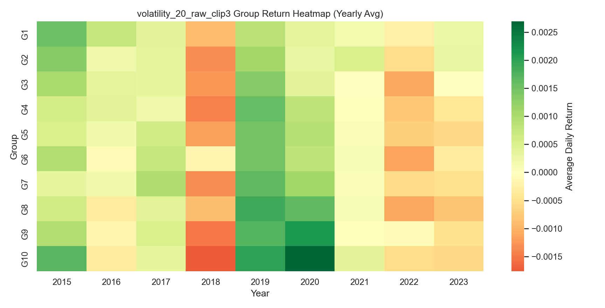

### 3. ROE因子 `roe_raw_clip3`

- 因子含义/计算方法：ROE原始因子，直接取财务字段 `ROE`；`clip3` 表示横截面3 sigma截尾后结果。
- IC分析：1日 IC 均值为 `0.0043`，1日 ICIR 为 `0.4226`，20日 IC 均值为 `0.0219`。当前 1日 IC 方向为`正`。
- 十分位回测：`LS_Gn_G1` 日均收益 `0.000220`，IR `0.2932`，累计收益 `0.3849`。当前多空累计收益方向为`正`。
结果文件地址：
- IC序列：`Factor_test/data/metrics/roe_raw_clip3/ic_series.csv`
- IC衰减统计：`Factor_test/data/metrics/roe_raw_clip3/ic_decay.csv`
- 分组收益统计表：`Factor_test/data/metrics/roe_raw_clip3/group_returns_stats.csv`
- 因子分布统计表：`Factor_test/data/metrics/roe_raw_clip3/factor_distribution_stats.csv`

IC衰减核心数据：

| 滞后期 | 样本数 | IC均值 | ICIR | 正IC占比 |
| --- | ---: | ---: | ---: | ---: |
| 1d | 2188 | 0.0043 | 0.4226 | 50.73% |
| 5d | 2184 | 0.0160 | 0.6491 | 53.25% |
| 10d | 2179 | 0.0202 | 0.5684 | 54.29% |
| 20d | 2169 | 0.0219 | 0.4392 | 54.17% |

分组收益核心数据：

| 组别 | 样本数 | 日均收益 | IR | 胜率 | 最大回撤 | 累计收益 |
| --- | ---: | ---: | ---: | ---: | ---: | ---: |
| G1 | 2188 | 0.000202 | 0.1818 | 51.92% | -0.6711 | 0.1043 |
| G10 | 2188 | 0.000422 | 0.4142 | 52.24% | -0.5676 | 0.8881 |
| LS_Gn_G1 | 2188 | 0.000220 | 0.2932 | 50.32% | -0.5743 | 0.3849 |

因子分布核心数据：

| 样本量 | 均值 | 标准差 | P5 | 中位数 | P95 | 偏度 | 峰度 |
| ---: | ---: | ---: | ---: | ---: | ---: | ---: | ---: |
| 656700 | 7.5221 | 7.7082 | 0.0396 | 5.8757 | 21.9710 | 1.1044 | 4.8383 |

IC衰减曲线：

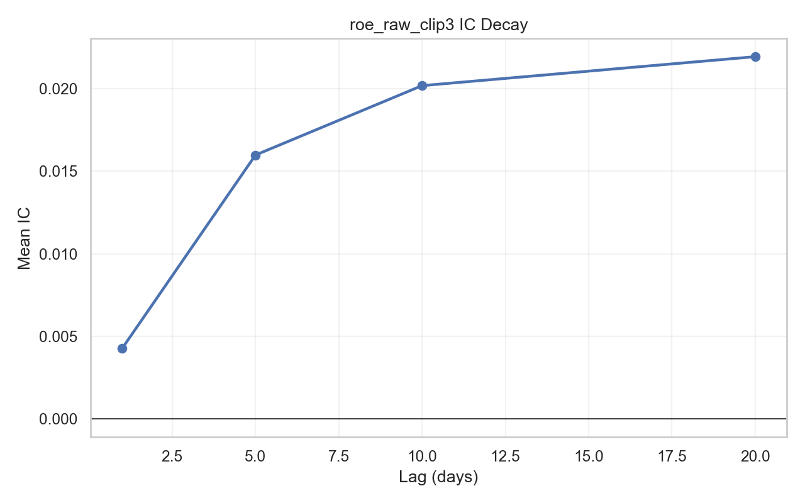

因子分布直方图：

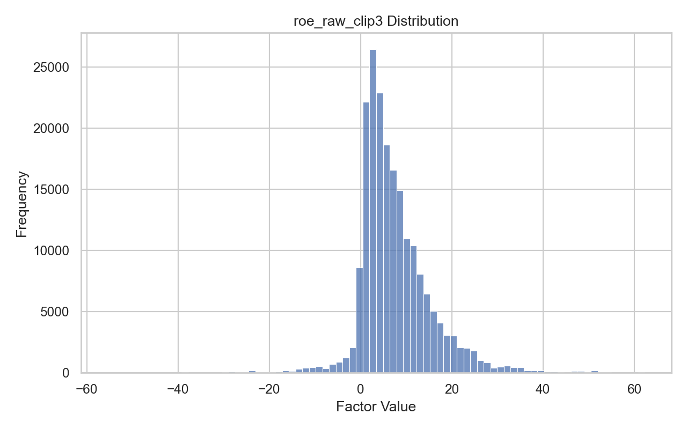

分组收益热力图：

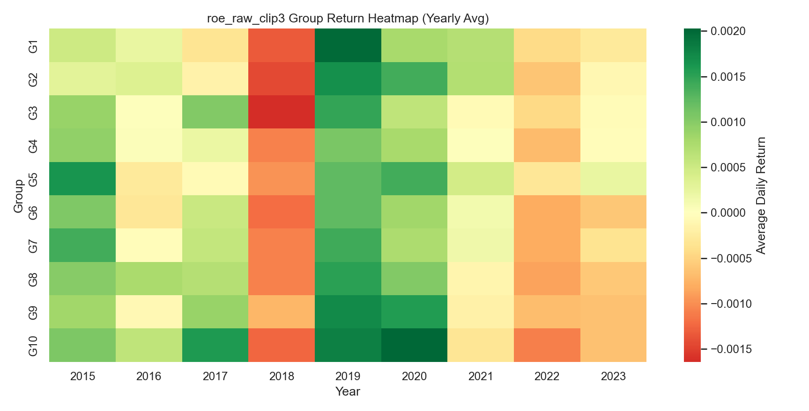

### 4. 对数市值因子 `size_log_mcap_raw_clip3`

- 因子含义/计算方法：对数市值因子，计算口径为 `log(TotalMarketCap)`；`clip3` 表示横截面3 sigma截尾后结果。
- IC分析：1日 IC 均值为 `0.0050`，1日 ICIR 为 `0.4308`，20日 IC 均值为 `0.0178`。当前 1日 IC 方向为`正`。
- 十分位回测：`LS_Gn_G1` 日均收益 `-0.000531`，IR `-0.4989`，累计收益 `-0.7739`。当前多空累计收益方向为`负`。
结果文件地址：
- IC序列：`Factor_test/data/metrics/size_log_mcap_raw_clip3/ic_series.csv`
- IC衰减统计：`Factor_test/data/metrics/size_log_mcap_raw_clip3/ic_decay.csv`
- 分组收益统计表：`Factor_test/data/metrics/size_log_mcap_raw_clip3/group_returns_stats.csv`
- 因子分布统计表：`Factor_test/data/metrics/size_log_mcap_raw_clip3/factor_distribution_stats.csv`

IC衰减核心数据：

| 滞后期 | 样本数 | IC均值 | ICIR | 正IC占比 |
| --- | ---: | ---: | ---: | ---: |
| 1d | 2188 | 0.0050 | 0.4308 | 51.60% |
| 5d | 2184 | 0.0099 | 0.3638 | 53.66% |
| 10d | 2179 | 0.0126 | 0.3232 | 54.75% |
| 20d | 2169 | 0.0178 | 0.3201 | 57.45% |

分组收益核心数据：

| 组别 | 样本数 | 日均收益 | IR | 胜率 | 最大回撤 | 累计收益 |
| --- | ---: | ---: | ---: | ---: | ---: | ---: |
| G1 | 2188 | 0.000741 | 0.5864 | 52.01% | -0.4654 | 2.2819 |
| G10 | 2188 | 0.000210 | 0.2493 | 50.78% | -0.4290 | 0.3005 |
| LS_Gn_G1 | 2188 | -0.000531 | -0.4989 | 48.13% | -0.8129 | -0.7739 |

因子分布核心数据：

| 样本量 | 均值 | 标准差 | P5 | 中位数 | P95 | 偏度 | 峰度 |
| ---: | ---: | ---: | ---: | ---: | ---: | ---: | ---: |
| 656700 | 24.9719 | 0.9209 | 23.7822 | 24.8116 | 26.7047 | 0.8570 | 0.5176 |

IC衰减曲线：

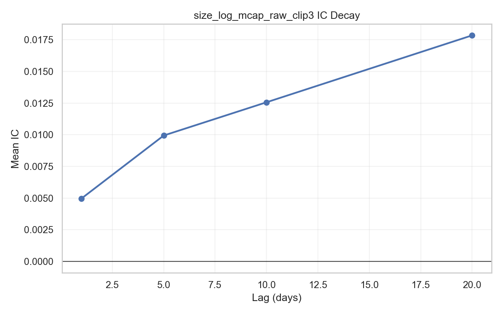

因子分布直方图：

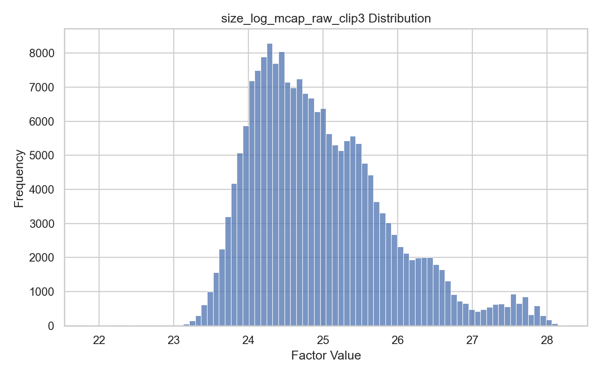

分组收益热力图：

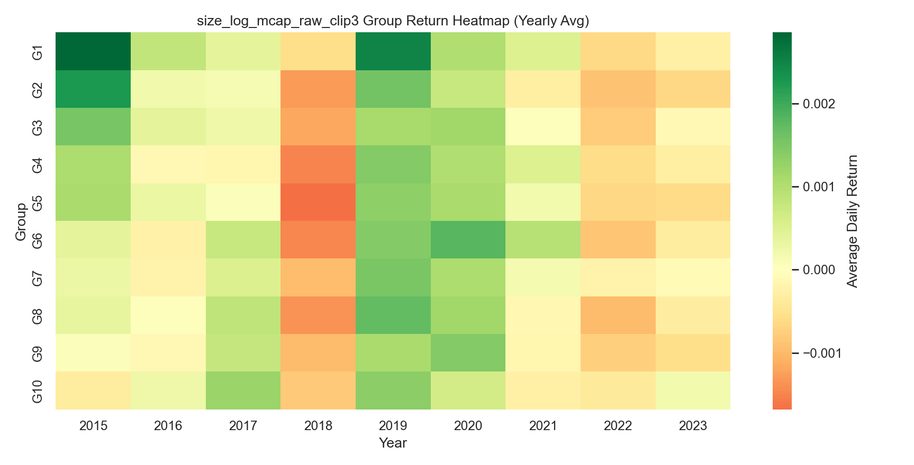

### 5. 20日换手率代理因子 `turnover_proxy_20_raw_clip3`

- 因子含义/计算方法：20日换手率代理因子，计算口径为过去20日 `Amount / TotalMarketCap` 的均值；`clip3` 表示横截面3 sigma截尾后结果。
- IC分析：1日 IC 均值为 `-0.0237`，1日 ICIR 为 `-1.7204`，20日 IC 均值为 `-0.0596`。当前 1日 IC 方向为`负`。
- 十分位回测：`LS_Gn_G1` 日均收益 `-0.000330`，IR `-0.2855`，累计收益 `-0.6648`。当前多空累计收益方向为`负`。
结果文件地址：
- IC序列：`Factor_test/data/metrics/turnover_proxy_20_raw_clip3/ic_series.csv`
- IC衰减统计：`Factor_test/data/metrics/turnover_proxy_20_raw_clip3/ic_decay.csv`
- 分组收益统计表：`Factor_test/data/metrics/turnover_proxy_20_raw_clip3/group_returns_stats.csv`
- 因子分布统计表：`Factor_test/data/metrics/turnover_proxy_20_raw_clip3/factor_distribution_stats.csv`

IC衰减核心数据：

| 滞后期 | 样本数 | IC均值 | ICIR | 正IC占比 |
| --- | ---: | ---: | ---: | ---: |
| 1d | 2188 | -0.0237 | -1.7204 | 45.16% |
| 5d | 2184 | -0.0383 | -1.2545 | 43.04% |
| 10d | 2179 | -0.0472 | -1.0926 | 42.59% |
| 20d | 2169 | -0.0596 | -0.9584 | 40.39% |

分组收益核心数据：

| 组别 | 样本数 | 日均收益 | IR | 胜率 | 最大回撤 | 累计收益 |
| --- | ---: | ---: | ---: | ---: | ---: | ---: |
| G1 | 2188 | 0.000283 | 0.4797 | 49.63% | -0.2944 | 0.6890 |
| G10 | 2188 | -0.000047 | -0.0343 | 51.14% | -0.7598 | -0.4619 |
| LS_Gn_G1 | 2188 | -0.000330 | -0.2855 | 50.64% | -0.7457 | -0.6648 |

因子分布核心数据：

| 样本量 | 均值 | 标准差 | P5 | 中位数 | P95 | 偏度 | 峰度 |
| ---: | ---: | ---: | ---: | ---: | ---: | ---: | ---: |
| 656700 | 0.0000 | 0.0000 | 0.0000 | 0.0000 | 0.0000 | 2.2560 | 6.5648 |

IC衰减曲线：

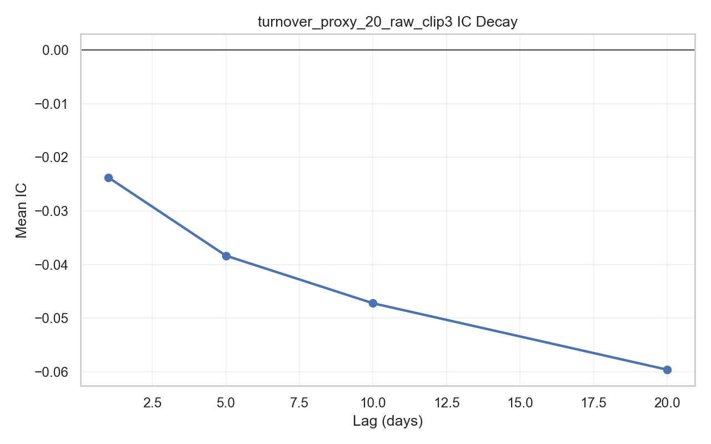

因子分布直方图：

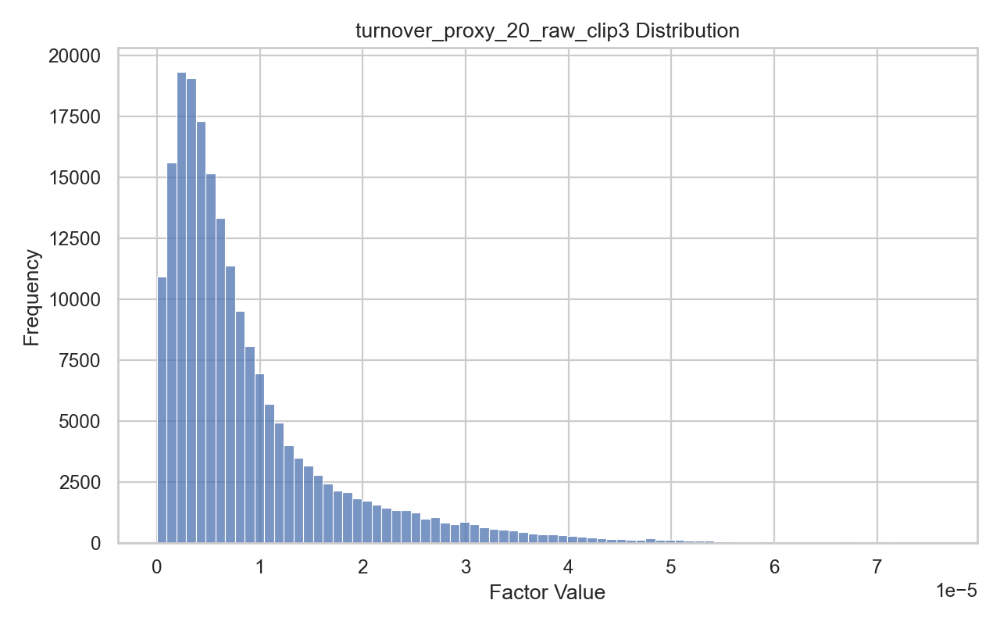

分组收益热力图：

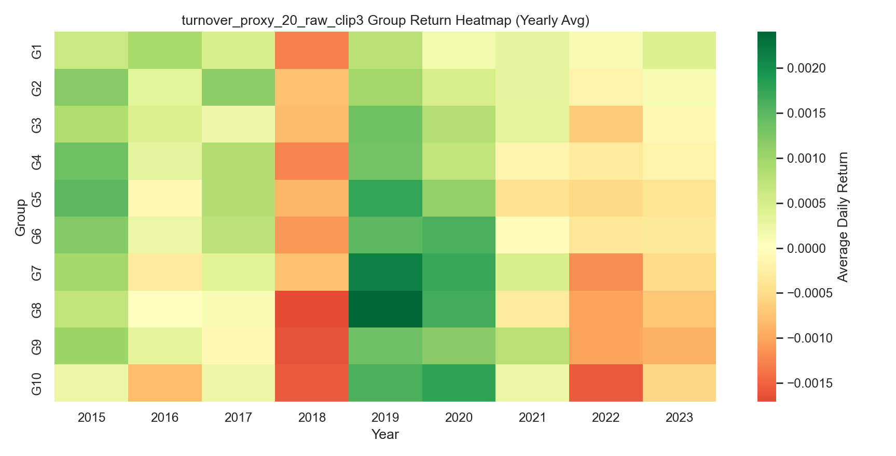

## 4. 其余因子详细结果

### 6. 5日动量因子 `momentum_5_raw_clip3`

- 因子含义/计算方法：过去5个交易日收盘价涨跌幅，计算口径为 `ClosePrice.pct_change(5)`；`clip3` 表示横截面3 sigma截尾后结果。
- IC分析：1日 IC 均值为 `-0.0351`，1日 ICIR 为 `-2.7648`，20日 IC 均值为 `-0.0105`。当前 1日 IC 方向为`负`。
- 十分位回测：`LS_Gn_G1` 日均收益 `0.000285`，IR `0.2747`，累计收益 `0.3882`。当前多空累计收益方向为`正`。
结果文件地址：
- IC序列：`Factor_test/data/metrics/momentum_5_raw_clip3/ic_series.csv`
- IC衰减统计：`Factor_test/data/metrics/momentum_5_raw_clip3/ic_decay.csv`
- 分组收益统计表：`Factor_test/data/metrics/momentum_5_raw_clip3/group_returns_stats.csv`
- 因子分布统计表：`Factor_test/data/metrics/momentum_5_raw_clip3/factor_distribution_stats.csv`

IC衰减核心数据：

| 滞后期 | 样本数 | IC均值 | ICIR | 正IC占比 |
| --- | ---: | ---: | ---: | ---: |
| 1d | 2188 | -0.0351 | -2.7648 | 43.33% |
| 5d | 2184 | -0.0229 | -0.8733 | 46.66% |
| 10d | 2179 | -0.0129 | -0.3552 | 49.20% |
| 20d | 2169 | -0.0105 | -0.2104 | 49.70% |

分组收益核心数据：

| 组别 | 样本数 | 日均收益 | IR | 胜率 | 最大回撤 | 累计收益 |
| --- | ---: | ---: | ---: | ---: | ---: | ---: |
| G1 | 2188 | -0.000062 | -0.0518 | 50.82% | -0.7182 | -0.4140 |
| G10 | 2188 | 0.000223 | 0.2082 | 51.37% | -0.6429 | 0.1862 |
| LS_Gn_G1 | 2188 | 0.000285 | 0.2747 | 48.77% | -0.4686 | 0.3882 |

因子分布核心数据：

| 样本量 | 均值 | 标准差 | P5 | 中位数 | P95 | 偏度 | 峰度 |
| ---: | ---: | ---: | ---: | ---: | ---: | ---: | ---: |
| 656700 | 0.0005 | 0.0581 | -0.0859 | 0.0000 | 0.0954 | 0.8482 | 17.5276 |

IC衰减曲线：

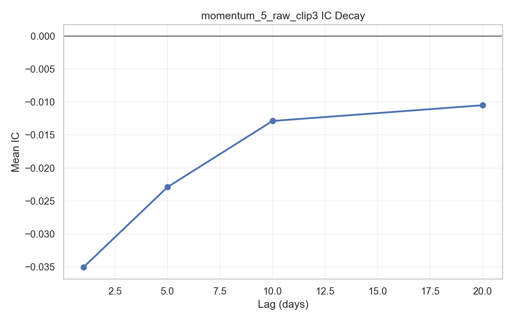

因子分布直方图：

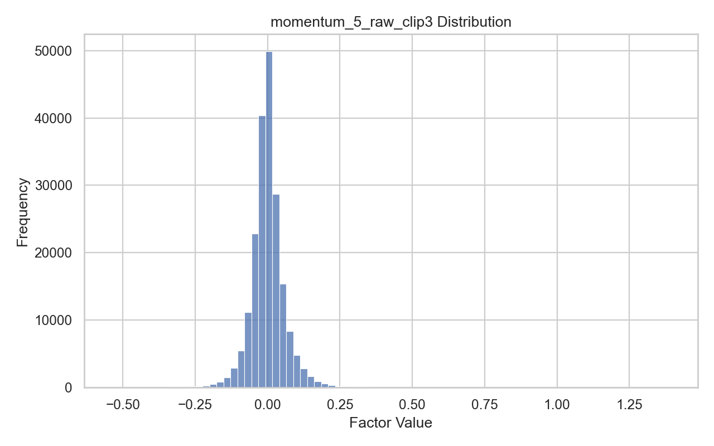

分组收益热力图：

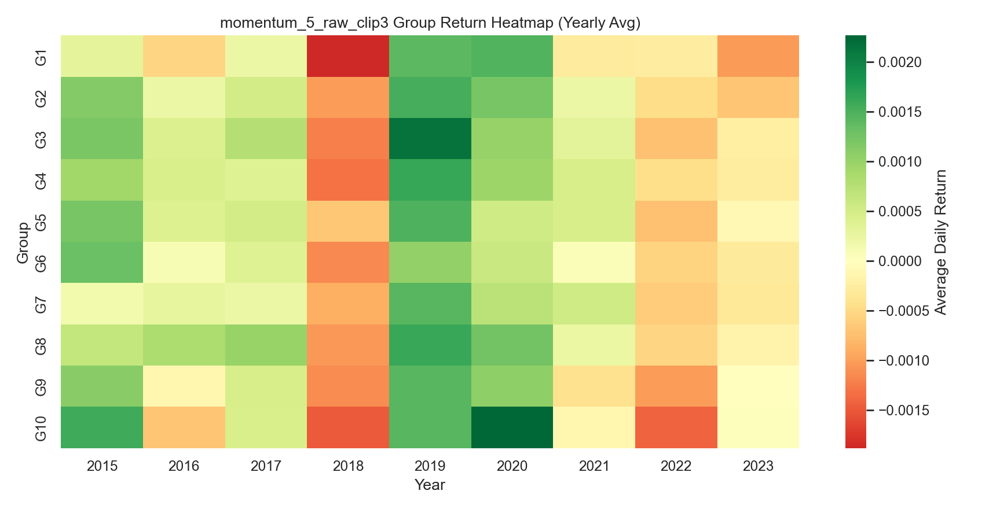

### 7. 60日动量因子 `momentum_60_raw_clip3`

- 因子含义/计算方法：过去60个交易日收盘价涨跌幅，计算口径为 `ClosePrice.pct_change(60)`；`clip3` 表示横截面3 sigma截尾后结果。
- IC分析：1日 IC 均值为 `-0.0049`，1日 ICIR 为 `-0.3712`，20日 IC 均值为 `0.0049`。当前 1日 IC 方向为`负`。
- 十分位回测：`LS_Gn_G1` 日均收益 `0.000276`，IR `0.2508`，累计收益 `0.3070`。当前多空累计收益方向为`正`。
结果文件地址：
- IC序列：`Factor_test/data/metrics/momentum_60_raw_clip3/ic_series.csv`
- IC衰减统计：`Factor_test/data/metrics/momentum_60_raw_clip3/ic_decay.csv`
- 分组收益统计表：`Factor_test/data/metrics/momentum_60_raw_clip3/group_returns_stats.csv`
- 因子分布统计表：`Factor_test/data/metrics/momentum_60_raw_clip3/factor_distribution_stats.csv`

IC衰减核心数据：

| 滞后期 | 样本数 | IC均值 | ICIR | 正IC占比 |
| --- | ---: | ---: | ---: | ---: |
| 1d | 2188 | -0.0049 | -0.3712 | 49.59% |
| 5d | 2184 | -0.0040 | -0.1333 | 51.01% |
| 10d | 2179 | -0.0007 | -0.0170 | 51.26% |
| 20d | 2169 | 0.0049 | 0.0858 | 50.90% |

分组收益核心数据：

| 组别 | 样本数 | 日均收益 | IR | 胜率 | 最大回撤 | 累计收益 |
| --- | ---: | ---: | ---: | ---: | ---: | ---: |
| G1 | 2188 | -0.000063 | -0.0530 | 49.73% | -0.5714 | -0.4121 |
| G10 | 2188 | 0.000213 | 0.1915 | 51.14% | -0.6650 | 0.1309 |
| LS_Gn_G1 | 2188 | 0.000276 | 0.2508 | 52.29% | -0.6204 | 0.3070 |

因子分布核心数据：

| 样本量 | 均值 | 标准差 | P5 | 中位数 | P95 | 偏度 | 峰度 |
| ---: | ---: | ---: | ---: | ---: | ---: | ---: | ---: |
| 656700 | 0.0153 | 0.2092 | -0.2690 | -0.0092 | 0.3951 | 1.3150 | 4.4233 |

IC衰减曲线：

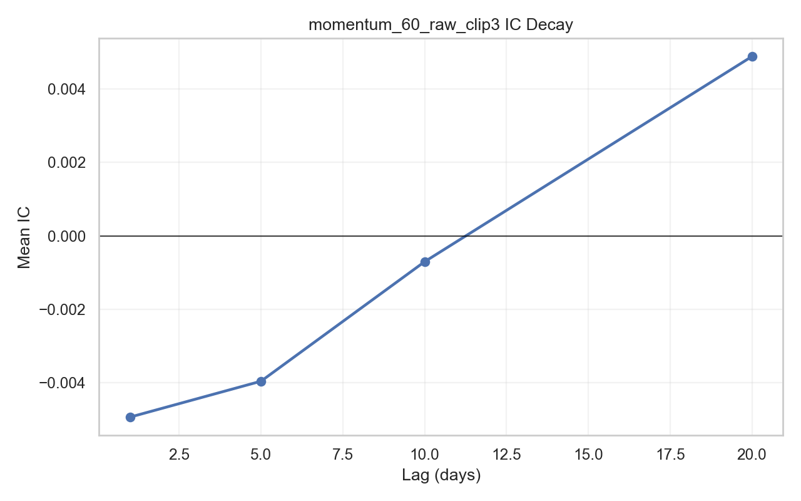

因子分布直方图：

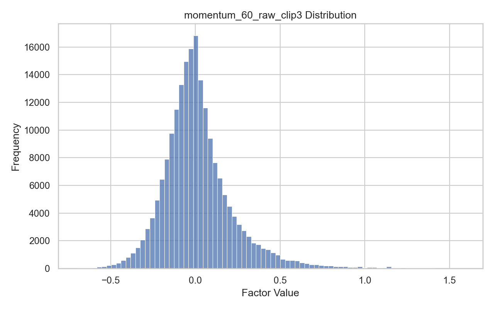

分组收益热力图：

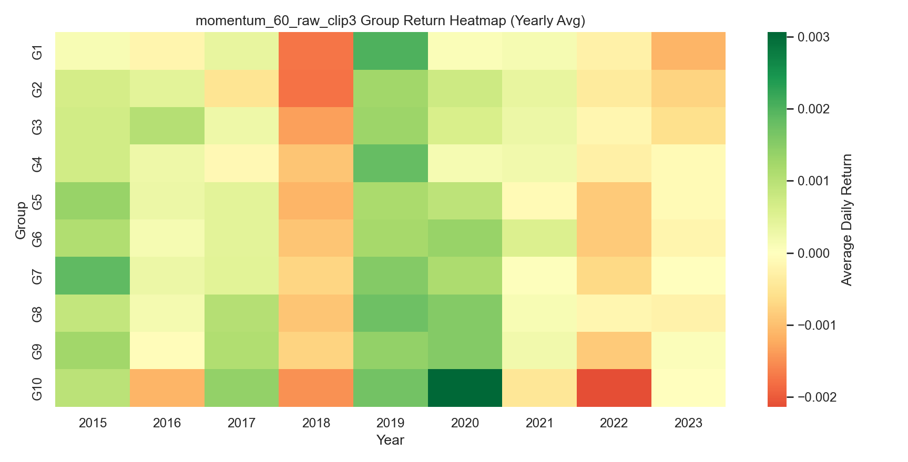

### 8. 5日反转因子 `reversal_5_raw_clip3`

- 因子含义/计算方法：5日反转因子，计算口径为 `- momentum_5_raw`，即短期涨得越多，因子值越低；`clip3` 表示横截面3 sigma截尾后结果。
- IC分析：1日 IC 均值为 `0.0351`，1日 ICIR 为 `2.7648`，20日 IC 均值为 `0.0105`。当前 1日 IC 方向为`正`。
- 十分位回测：`LS_Gn_G1` 日均收益 `-0.000287`，IR `-0.2766`，累计收益 `-0.6041`。当前多空累计收益方向为`负`。
结果文件地址：
- IC序列：`Factor_test/data/metrics/reversal_5_raw_clip3/ic_series.csv`
- IC衰减统计：`Factor_test/data/metrics/reversal_5_raw_clip3/ic_decay.csv`
- 分组收益统计表：`Factor_test/data/metrics/reversal_5_raw_clip3/group_returns_stats.csv`
- 因子分布统计表：`Factor_test/data/metrics/reversal_5_raw_clip3/factor_distribution_stats.csv`

IC衰减核心数据：

| 滞后期 | 样本数 | IC均值 | ICIR | 正IC占比 |
| --- | ---: | ---: | ---: | ---: |
| 1d | 2188 | 0.0351 | 2.7648 | 56.67% |
| 5d | 2184 | 0.0229 | 0.8733 | 53.34% |
| 10d | 2179 | 0.0129 | 0.3552 | 50.80% |
| 20d | 2169 | 0.0105 | 0.2104 | 50.30% |

分组收益核心数据：

| 组别 | 样本数 | 日均收益 | IR | 胜率 | 最大回撤 | 累计收益 |
| --- | ---: | ---: | ---: | ---: | ---: | ---: |
| G1 | 2188 | 0.000222 | 0.2074 | 51.37% | -0.6426 | 0.1841 |
| G10 | 2188 | -0.000065 | -0.0541 | 50.87% | -0.7193 | -0.4174 |
| LS_Gn_G1 | 2188 | -0.000287 | -0.2766 | 51.19% | -0.6506 | -0.6041 |

因子分布核心数据：

| 样本量 | 均值 | 标准差 | P5 | 中位数 | P95 | 偏度 | 峰度 |
| ---: | ---: | ---: | ---: | ---: | ---: | ---: | ---: |
| 656700 | -0.0005 | 0.0581 | -0.0954 | 0.0000 | 0.0859 | -0.8482 | 17.5276 |

IC衰减曲线：

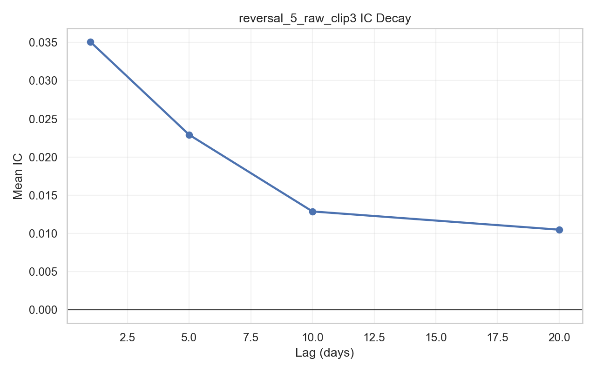

因子分布直方图：

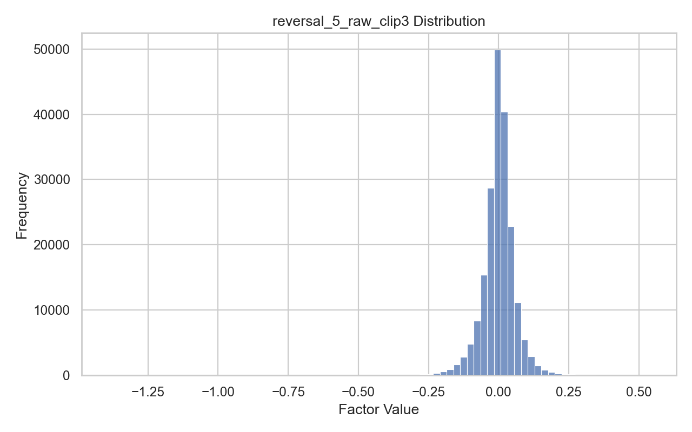

分组收益热力图：

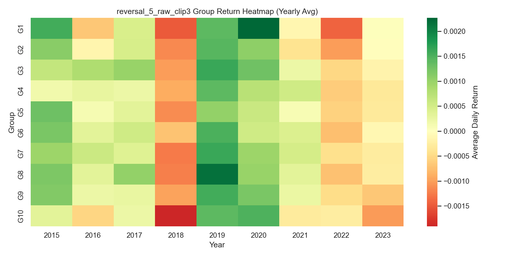

### 9. 20日下行波动率因子 `downside_vol_20_raw_clip3`

- 因子含义/计算方法：过去20个交易日负收益波动率，先将正收益置为0，仅保留负收益，再计算20日滚动标准差；`clip3` 表示横截面3 sigma截尾后结果。
- IC分析：1日 IC 均值为 `-0.0167`，1日 ICIR 为 `-1.1365`，20日 IC 均值为 `-0.0354`。当前 1日 IC 方向为`负`。
- 十分位回测：`LS_Gn_G1` 日均收益 `-0.000247`，IR `-0.1978`，累计收益 `-0.6159`。当前多空累计收益方向为`负`。
结果文件地址：
- IC序列：`Factor_test/data/metrics/downside_vol_20_raw_clip3/ic_series.csv`
- IC衰减统计：`Factor_test/data/metrics/downside_vol_20_raw_clip3/ic_decay.csv`
- 分组收益统计表：`Factor_test/data/metrics/downside_vol_20_raw_clip3/group_returns_stats.csv`
- 因子分布统计表：`Factor_test/data/metrics/downside_vol_20_raw_clip3/factor_distribution_stats.csv`

IC衰减核心数据：

| 滞后期 | 样本数 | IC均值 | ICIR | 正IC占比 |
| --- | ---: | ---: | ---: | ---: |
| 1d | 2188 | -0.0167 | -1.1365 | 45.52% |
| 5d | 2184 | -0.0267 | -0.8180 | 43.32% |
| 10d | 2179 | -0.0317 | -0.6969 | 44.24% |
| 20d | 2169 | -0.0354 | -0.5584 | 42.32% |

分组收益核心数据：

| 组别 | 样本数 | 日均收益 | IR | 胜率 | 最大回撤 | 累计收益 |
| --- | ---: | ---: | ---: | ---: | ---: | ---: |
| G1 | 2188 | 0.000344 | 0.6277 | 50.46% | -0.2643 | 0.9534 |
| G10 | 2188 | 0.000097 | 0.0689 | 50.32% | -0.7077 | -0.2779 |
| LS_Gn_G1 | 2188 | -0.000247 | -0.1978 | 49.04% | -0.7275 | -0.6159 |

因子分布核心数据：

| 样本量 | 均值 | 标准差 | P5 | 中位数 | P95 | 偏度 | 峰度 |
| ---: | ---: | ---: | ---: | ---: | ---: | ---: | ---: |
| 656700 | 0.0128 | 0.0076 | 0.0039 | 0.0110 | 0.0272 | 1.3118 | 2.1949 |

IC衰减曲线：

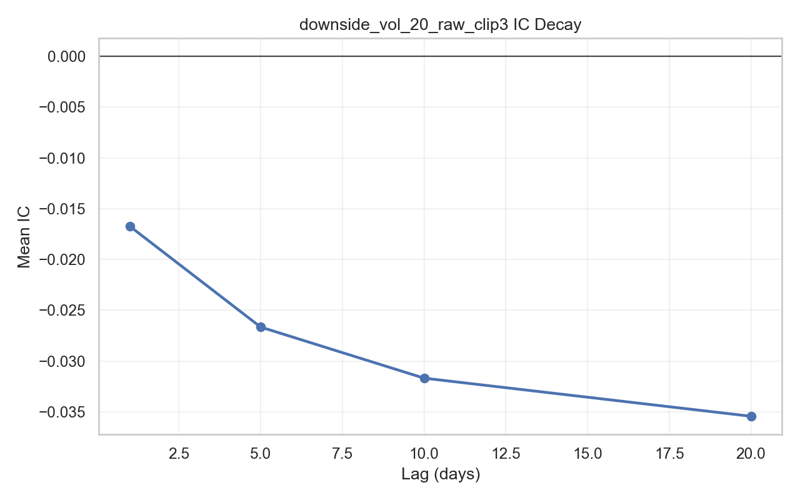

因子分布直方图：

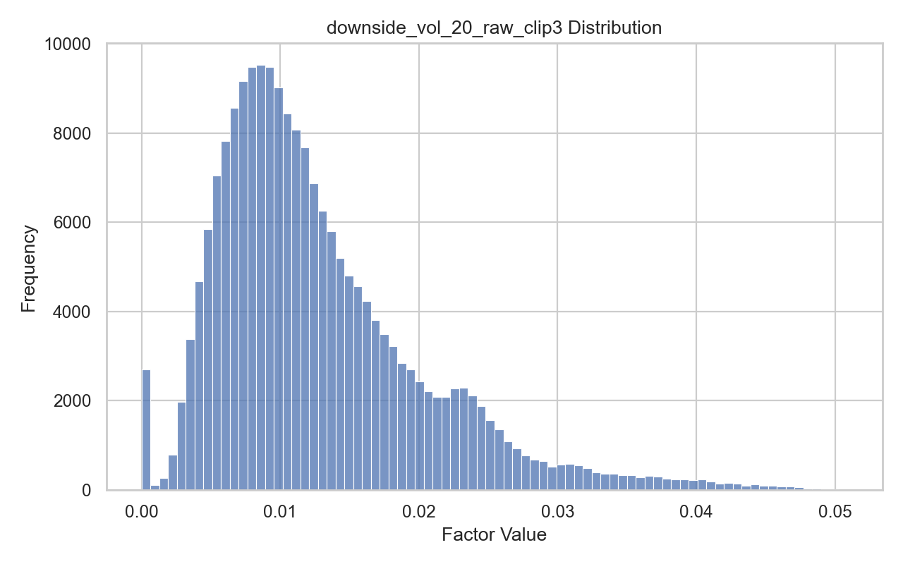

分组收益热力图：

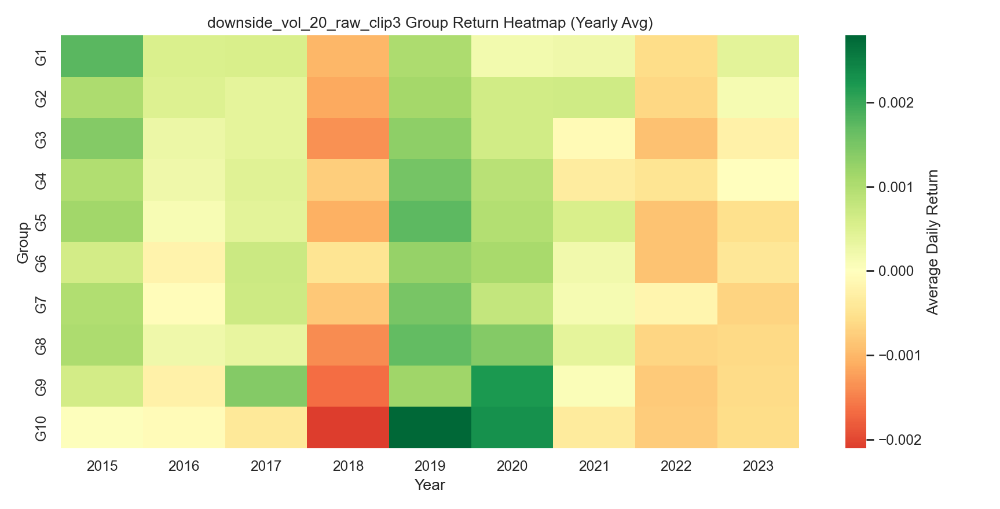

### 10. 20日回撤因子 `drawdown_20_raw_clip3`

- 因子含义/计算方法：20日回撤，计算口径为 `ClosePrice / rolling_max_20 - 1`，反映当前价格相对近20日最高价的回撤幅度；`clip3` 表示横截面3 sigma截尾后结果。
- IC分析：1日 IC 均值为 `-0.0133`，1日 ICIR 为 `-0.9551`，20日 IC 均值为 `0.0122`。当前 1日 IC 方向为`负`。
- 十分位回测：`LS_Gn_G1` 日均收益 `0.000202`，IR `0.1829`，累计收益 `0.1091`。当前多空累计收益方向为`正`。
结果文件地址：
- IC序列：`Factor_test/data/metrics/drawdown_20_raw_clip3/ic_series.csv`
- IC衰减统计：`Factor_test/data/metrics/drawdown_20_raw_clip3/ic_decay.csv`
- 分组收益统计表：`Factor_test/data/metrics/drawdown_20_raw_clip3/group_returns_stats.csv`
- 因子分布统计表：`Factor_test/data/metrics/drawdown_20_raw_clip3/factor_distribution_stats.csv`

IC衰减核心数据：

| 滞后期 | 样本数 | IC均值 | ICIR | 正IC占比 |
| --- | ---: | ---: | ---: | ---: |
| 1d | 2188 | -0.0133 | -0.9551 | 48.35% |
| 5d | 2184 | 0.0039 | 0.1338 | 52.66% |
| 10d | 2179 | 0.0150 | 0.3688 | 55.81% |
| 20d | 2169 | 0.0122 | 0.2213 | 55.88% |

分组收益核心数据：

| 组别 | 样本数 | 日均收益 | IR | 胜率 | 最大回撤 | 累计收益 |
| --- | ---: | ---: | ---: | ---: | ---: | ---: |
| G1 | 2188 | 0.000202 | 0.1573 | 51.97% | -0.5733 | -0.0125 |
| G10 | 2188 | 0.000404 | 0.5178 | 50.14% | -0.4534 | 1.0452 |
| LS_Gn_G1 | 2188 | 0.000202 | 0.1829 | 50.41% | -0.5676 | 0.1091 |

因子分布核心数据：

| 样本量 | 均值 | 标准差 | P5 | 中位数 | P95 | 偏度 | 峰度 |
| ---: | ---: | ---: | ---: | ---: | ---: | ---: | ---: |
| 656700 | -0.0634 | 0.0645 | -0.1866 | -0.0465 | 0.0000 | -1.8864 | 5.6680 |

IC衰减曲线：

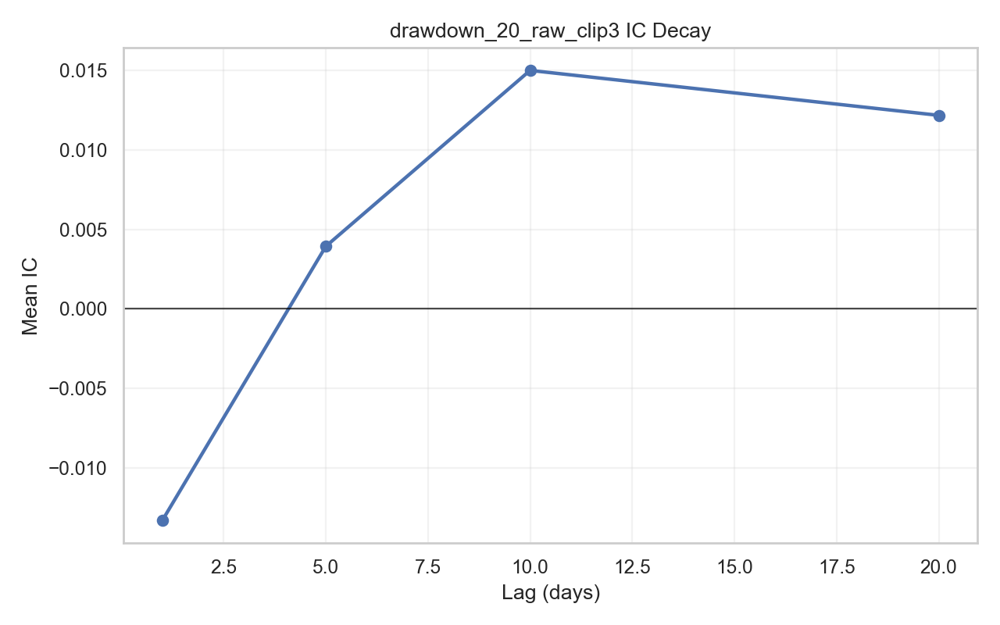

因子分布直方图：

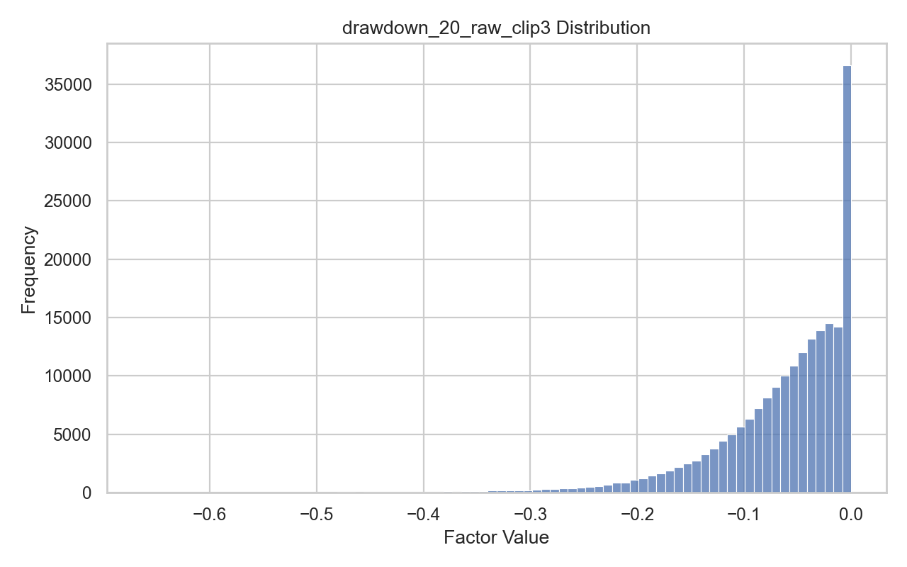

分组收益热力图：

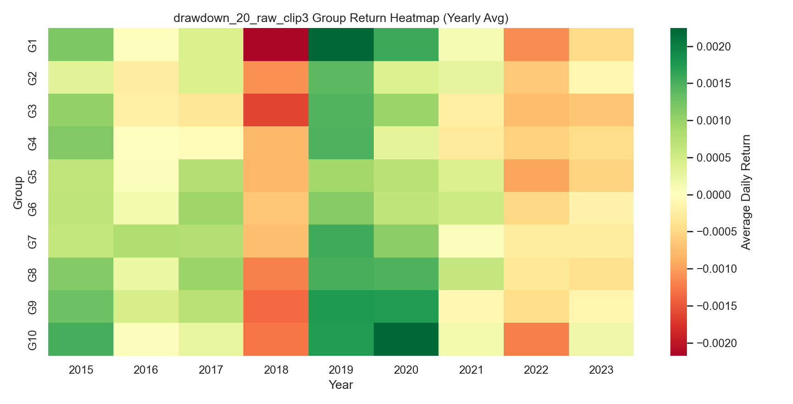

### 11. 20日非流动性因子 `illiq_20_raw_clip3`

- 因子含义/计算方法：20日非流动性因子，计算口径为过去20日 `abs(ret_1d) / (abs(Amount) + 1)` 的均值；`clip3` 表示横截面3 sigma截尾后结果。
- IC分析：1日 IC 均值为 `0.0022`，1日 ICIR 为 `0.2282`，20日 IC 均值为 `0.0082`。当前 1日 IC 方向为`正`。
- 十分位回测：`LS_Gn_G1` 日均收益 `0.000628`，IR `0.7275`，累计收益 `2.2275`。当前多空累计收益方向为`正`。
结果文件地址：
- IC序列：`Factor_test/data/metrics/illiq_20_raw_clip3/ic_series.csv`
- IC衰减统计：`Factor_test/data/metrics/illiq_20_raw_clip3/ic_decay.csv`
- 分组收益统计表：`Factor_test/data/metrics/illiq_20_raw_clip3/group_returns_stats.csv`
- 因子分布统计表：`Factor_test/data/metrics/illiq_20_raw_clip3/factor_distribution_stats.csv`

IC衰减核心数据：

| 滞后期 | 样本数 | IC均值 | ICIR | 正IC占比 |
| --- | ---: | ---: | ---: | ---: |
| 1d | 2188 | 0.0022 | 0.2282 | 49.36% |
| 5d | 2184 | 0.0032 | 0.1475 | 48.76% |
| 10d | 2179 | 0.0060 | 0.1932 | 50.02% |
| 20d | 2169 | 0.0082 | 0.1882 | 50.76% |

分组收益核心数据：

| 组别 | 样本数 | 日均收益 | IR | 胜率 | 最大回撤 | 累计收益 |
| --- | ---: | ---: | ---: | ---: | ---: | ---: |
| G1 | 2188 | 0.000038 | 0.0489 | 50.18% | -0.4839 | -0.0820 |
| G10 | 2188 | 0.000666 | 0.6019 | 51.97% | -0.3796 | 2.0728 |
| LS_Gn_G1 | 2188 | 0.000628 | 0.7275 | 51.65% | -0.2890 | 2.2275 |

因子分布核心数据：

| 样本量 | 均值 | 标准差 | P5 | 中位数 | P95 | 偏度 | 峰度 |
| ---: | ---: | ---: | ---: | ---: | ---: | ---: | ---: |
| 656700 | 0.0000 | 0.0000 | 0.0000 | 0.0000 | 0.0000 | 79.0663 | 10801.7162 |

IC衰减曲线：

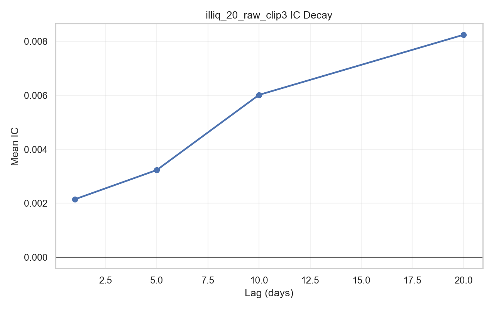

因子分布直方图：

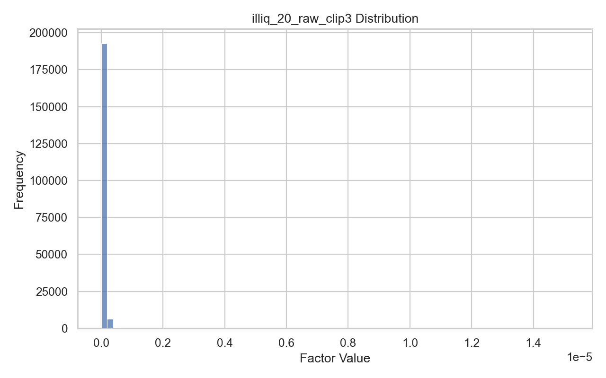

分组收益热力图：

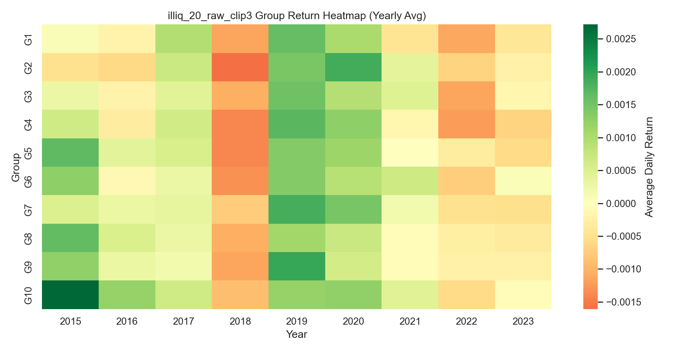

### 12. EP(TTM)因子 `ep_ttm_raw_clip3`

- 因子含义/计算方法：EP(TTM)因子，计算口径为 `1 / PE_TTM`；`clip3` 表示横截面3 sigma截尾后结果。
- IC分析：1日 IC 均值为 `0.0167`，1日 ICIR 为 `1.3050`，20日 IC 均值为 `0.0412`。当前 1日 IC 方向为`正`。
- 十分位回测：`LS_Gn_G1` 日均收益 `-0.000121`，IR `-0.1260`，累计收益 `-0.4077`。当前多空累计收益方向为`负`。
结果文件地址：
- IC序列：`Factor_test/data/metrics/ep_ttm_raw_clip3/ic_series.csv`
- IC衰减统计：`Factor_test/data/metrics/ep_ttm_raw_clip3/ic_decay.csv`
- 分组收益统计表：`Factor_test/data/metrics/ep_ttm_raw_clip3/group_returns_stats.csv`
- 因子分布统计表：`Factor_test/data/metrics/ep_ttm_raw_clip3/factor_distribution_stats.csv`

IC衰减核心数据：

| 滞后期 | 样本数 | IC均值 | ICIR | 正IC占比 |
| --- | ---: | ---: | ---: | ---: |
| 1d | 2188 | 0.0167 | 1.3050 | 52.10% |
| 5d | 2184 | 0.0258 | 0.8801 | 53.30% |
| 10d | 2179 | 0.0323 | 0.7778 | 55.21% |
| 20d | 2169 | 0.0412 | 0.6900 | 56.98% |

分组收益核心数据：

| 组别 | 样本数 | 日均收益 | IR | 胜率 | 最大回撤 | 累计收益 |
| --- | ---: | ---: | ---: | ---: | ---: | ---: |
| G1 | 2188 | 0.000381 | 0.3271 | 52.74% | -0.5784 | 0.5835 |
| G10 | 2188 | 0.000259 | 0.3053 | 49.95% | -0.3691 | 0.4445 |
| LS_Gn_G1 | 2188 | -0.000121 | -0.1260 | 47.53% | -0.6115 | -0.4077 |

因子分布核心数据：

| 样本量 | 均值 | 标准差 | P5 | 中位数 | P95 | 偏度 | 峰度 |
| ---: | ---: | ---: | ---: | ---: | ---: | ---: | ---: |
| 656700 | 0.0532 | 0.0561 | 0.0016 | 0.0393 | 0.1670 | 0.7940 | 4.0936 |

IC衰减曲线：

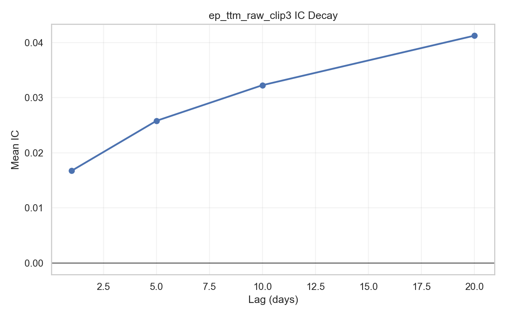

因子分布直方图：

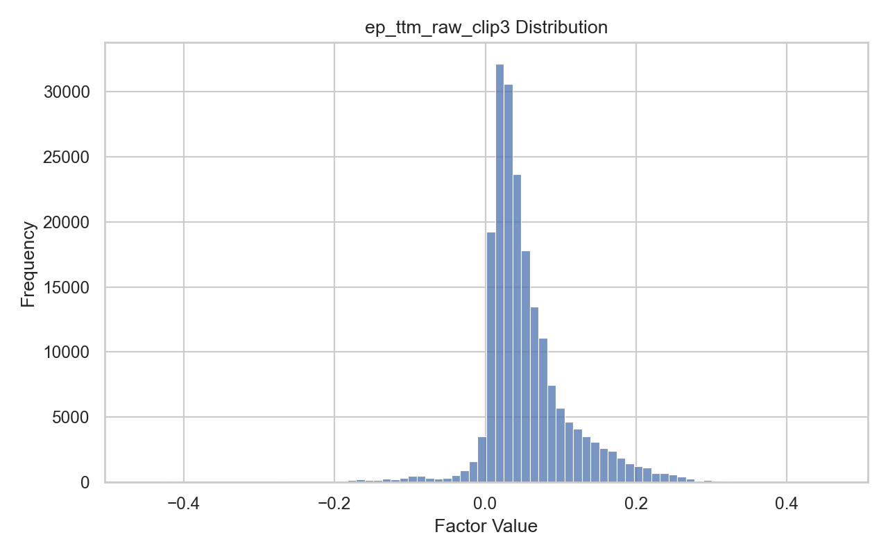

分组收益热力图：

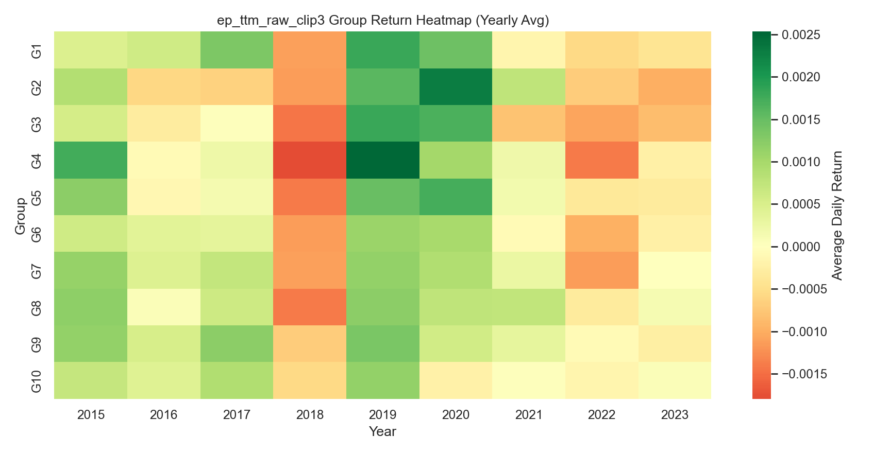

### 13. BP倒数因子 `bp_inv_raw_clip3`

- 因子含义/计算方法：BP倒数因子，计算口径为 `1 / PB`；`clip3` 表示横截面3 sigma截尾后结果。
- IC分析：1日 IC 均值为 `0.0175`，1日 ICIR 为 `1.2196`，20日 IC 均值为 `0.0314`。当前 1日 IC 方向为`正`。
- 十分位回测：`LS_Gn_G1` 日均收益 `-0.000007`，IR `-0.0067`，累计收益 `-0.2610`。当前多空累计收益方向为`负`。
结果文件地址：
- IC序列：`Factor_test/data/metrics/bp_inv_raw_clip3/ic_series.csv`
- IC衰减统计：`Factor_test/data/metrics/bp_inv_raw_clip3/ic_decay.csv`
- 分组收益统计表：`Factor_test/data/metrics/bp_inv_raw_clip3/group_returns_stats.csv`
- 因子分布统计表：`Factor_test/data/metrics/bp_inv_raw_clip3/factor_distribution_stats.csv`

IC衰减核心数据：

| 滞后期 | 样本数 | IC均值 | ICIR | 正IC占比 |
| --- | ---: | ---: | ---: | ---: |
| 1d | 2188 | 0.0175 | 1.2196 | 51.87% |
| 5d | 2184 | 0.0176 | 0.5194 | 51.05% |
| 10d | 2179 | 0.0213 | 0.4303 | 53.51% |
| 20d | 2169 | 0.0314 | 0.4403 | 54.03% |

分组收益核心数据：

| 组别 | 样本数 | 日均收益 | IR | 胜率 | 最大回撤 | 累计收益 |
| --- | ---: | ---: | ---: | ---: | ---: | ---: |
| G1 | 2188 | 0.000367 | 0.3131 | 50.27% | -0.6357 | 0.5283 |
| G10 | 2188 | 0.000360 | 0.4218 | 50.82% | -0.3359 | 0.7971 |
| LS_Gn_G1 | 2188 | -0.000007 | -0.0067 | 49.36% | -0.7506 | -0.2610 |

因子分布核心数据：

| 样本量 | 均值 | 标准差 | P5 | 中位数 | P95 | 偏度 | 峰度 |
| ---: | ---: | ---: | ---: | ---: | ---: | ---: | ---: |
| 656700 | 0.5177 | 0.4117 | 0.0839 | 0.4010 | 1.3360 | 1.5249 | 2.7382 |

IC衰减曲线：

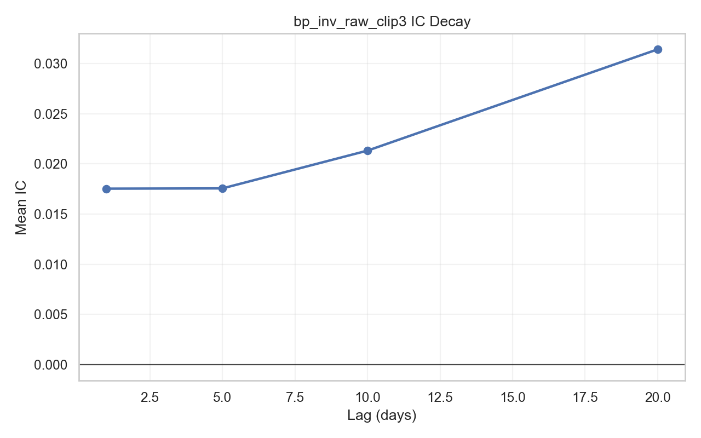

因子分布直方图：

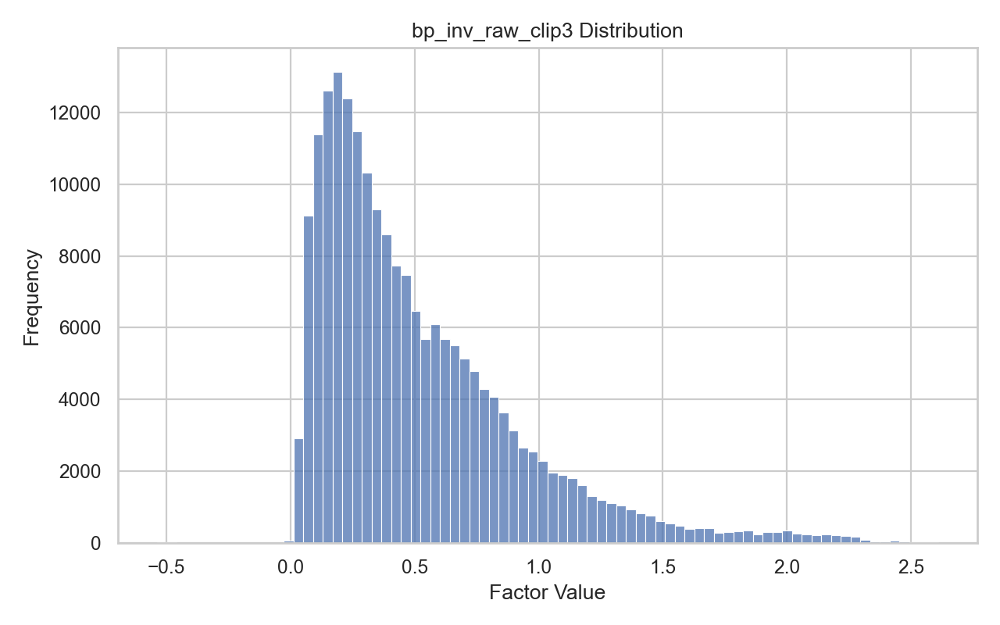

分组收益热力图：

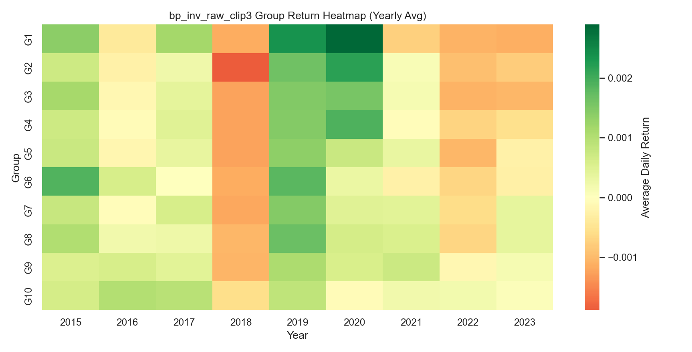

### 14. 营收同比因子 `revenue_yoy_raw_clip3`

- 因子含义/计算方法：营收同比因子，直接取财务字段 `Revenue_YoY`；`clip3` 表示横截面3 sigma截尾后结果。
- IC分析：1日 IC 均值为 `-0.0015`，1日 ICIR 为 `-0.1750`，20日 IC 均值为 `0.0034`。当前 1日 IC 方向为`负`。
- 十分位回测：`LS_Gn_G1` 日均收益 `0.000042`，IR `0.0573`，累计收益 `-0.0530`。当前多空累计收益方向为`负`。
结果文件地址：
- IC序列：`Factor_test/data/metrics/revenue_yoy_raw_clip3/ic_series.csv`
- IC衰减统计：`Factor_test/data/metrics/revenue_yoy_raw_clip3/ic_decay.csv`
- 分组收益统计表：`Factor_test/data/metrics/revenue_yoy_raw_clip3/group_returns_stats.csv`
- 因子分布统计表：`Factor_test/data/metrics/revenue_yoy_raw_clip3/factor_distribution_stats.csv`

IC衰减核心数据：

| 滞后期 | 样本数 | IC均值 | ICIR | 正IC占比 |
| --- | ---: | ---: | ---: | ---: |
| 1d | 2188 | -0.0015 | -0.1750 | 49.82% |
| 5d | 2184 | 0.0005 | 0.0266 | 50.69% |
| 10d | 2179 | 0.0020 | 0.0683 | 53.19% |
| 20d | 2169 | 0.0034 | 0.0796 | 54.54% |

分组收益核心数据：

| 组别 | 样本数 | 日均收益 | IR | 胜率 | 最大回撤 | 累计收益 |
| --- | ---: | ---: | ---: | ---: | ---: | ---: |
| G1 | 2188 | 0.000031 | 0.0292 | 50.27% | -0.6883 | -0.2167 |
| G10 | 2188 | 0.000073 | 0.0630 | 49.27% | -0.5637 | -0.1888 |
| LS_Gn_G1 | 2188 | 0.000042 | 0.0573 | 50.82% | -0.5305 | -0.0530 |

因子分布核心数据：

| 样本量 | 均值 | 标准差 | P5 | 中位数 | P95 | 偏度 | 峰度 |
| ---: | ---: | ---: | ---: | ---: | ---: | ---: | ---: |
| 656700 | 17.3384 | 38.0945 | -27.6869 | 11.1672 | 82.9116 | 2.7170 | 19.9197 |

IC衰减曲线：

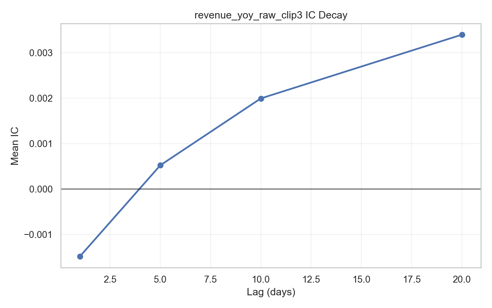

因子分布直方图：

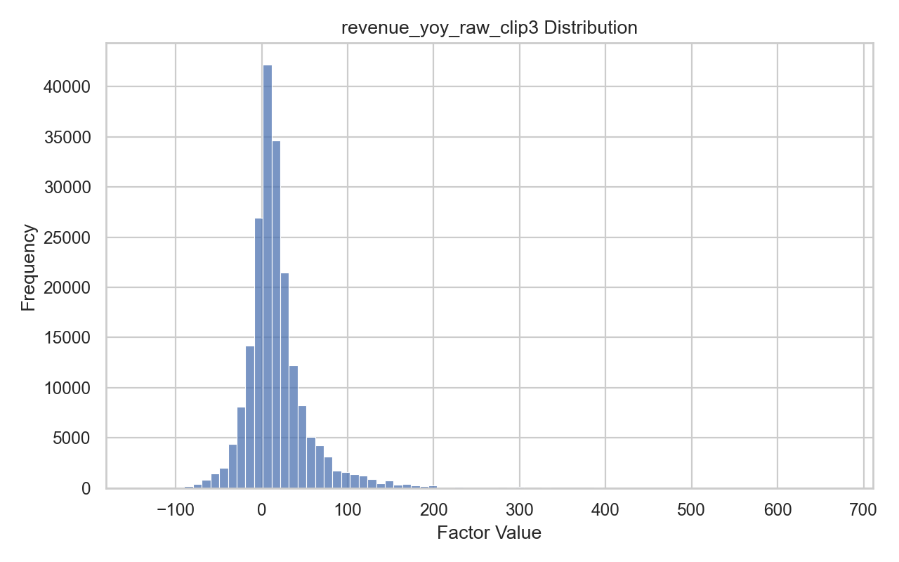

分组收益热力图：

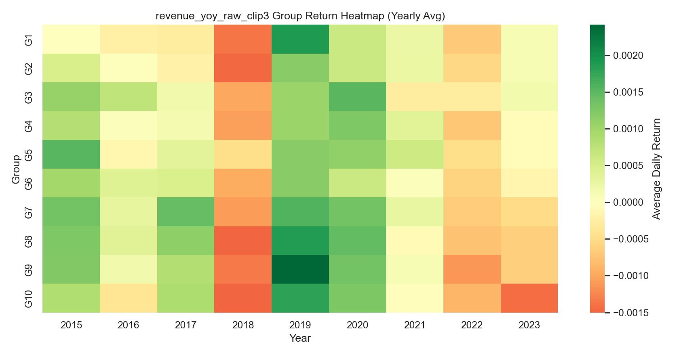

### 15. 净利润同比因子 `netprofit_yoy_raw_clip3`

- 因子含义/计算方法：净利润同比因子，直接取财务字段 `NetProfit_YoY`；`clip3` 表示横截面3 sigma截尾后结果。
- IC分析：1日 IC 均值为 `0.0025`，1日 ICIR 为 `0.3141`，20日 IC 均值为 `-0.0012`。当前 1日 IC 方向为`正`。
- 十分位回测：`LS_Gn_G1` 日均收益 `-0.000039`，IR `-0.0583`，累计收益 `-0.1861`。当前多空累计收益方向为`负`。
结果文件地址：
- IC序列：`Factor_test/data/metrics/netprofit_yoy_raw_clip3/ic_series.csv`
- IC衰减统计：`Factor_test/data/metrics/netprofit_yoy_raw_clip3/ic_decay.csv`
- 分组收益统计表：`Factor_test/data/metrics/netprofit_yoy_raw_clip3/group_returns_stats.csv`
- 因子分布统计表：`Factor_test/data/metrics/netprofit_yoy_raw_clip3/factor_distribution_stats.csv`

IC衰减核心数据：

| 滞后期 | 样本数 | IC均值 | ICIR | 正IC占比 |
| --- | ---: | ---: | ---: | ---: |
| 1d | 2188 | 0.0025 | 0.3141 | 50.23% |
| 5d | 2184 | 0.0020 | 0.1121 | 51.28% |
| 10d | 2179 | 0.0004 | 0.0132 | 51.03% |
| 20d | 2169 | -0.0012 | -0.0325 | 52.28% |

分组收益核心数据：

| 组别 | 样本数 | 日均收益 | IR | 胜率 | 最大回撤 | 累计收益 |
| --- | ---: | ---: | ---: | ---: | ---: | ---: |
| G1 | 2188 | 0.000216 | 0.1987 | 51.92% | -0.6730 | 0.1551 |
| G10 | 2188 | 0.000178 | 0.1585 | 51.14% | -0.5129 | 0.0407 |
| LS_Gn_G1 | 2188 | -0.000039 | -0.0583 | 50.14% | -0.5139 | -0.1861 |

因子分布核心数据：

| 样本量 | 均值 | 标准差 | P5 | 中位数 | P95 | 偏度 | 峰度 |
| ---: | ---: | ---: | ---: | ---: | ---: | ---: | ---: |
| 656700 | 31.4264 | 266.7564 | -84.9690 | 10.7876 | 223.1387 | 0.2829 | 312.1377 |

IC衰减曲线：

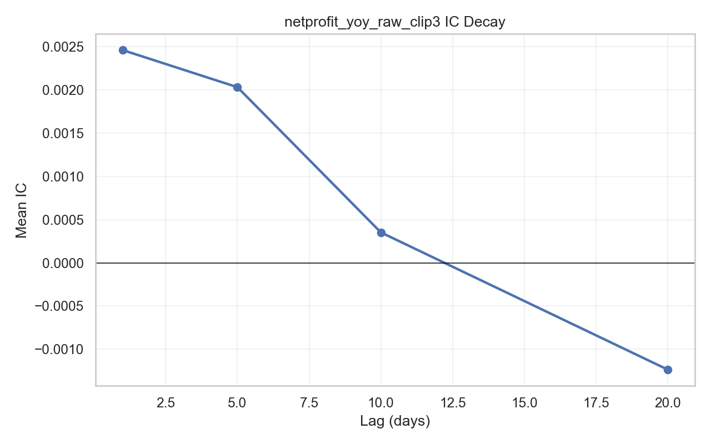

因子分布直方图：

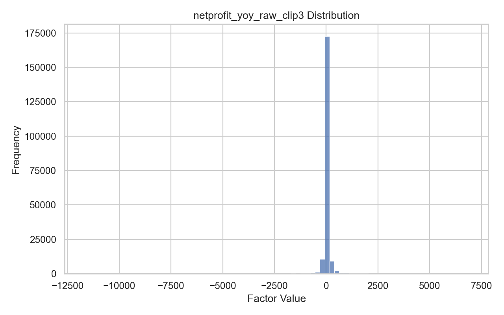

分组收益热力图：

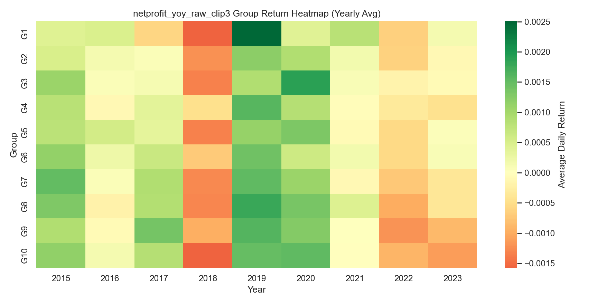

## 5. 全因子汇总表

| 因子 | 1日IC均值 | 1日ICIR | 多空日均收益 | 多空IR | 多空累计收益 | 输出目录 |
| --- | ---: | ---: | ---: | ---: | ---: | --- |
| bp_inv_raw_clip3 | 0.0175 | 1.2196 | -0.000007 | -0.0067 | -0.2610 | `Factor_test/data/metrics/bp_inv_raw_clip3` |
| downside_vol_20_raw_clip3 | -0.0167 | -1.1365 | -0.000247 | -0.1978 | -0.6159 | `Factor_test/data/metrics/downside_vol_20_raw_clip3` |
| drawdown_20_raw_clip3 | -0.0133 | -0.9551 | 0.000202 | 0.1829 | 0.1091 | `Factor_test/data/metrics/drawdown_20_raw_clip3` |
| ep_ttm_raw_clip3 | 0.0167 | 1.3050 | -0.000121 | -0.1260 | -0.4077 | `Factor_test/data/metrics/ep_ttm_raw_clip3` |
| illiq_20_raw_clip3 | 0.0022 | 0.2282 | 0.000628 | 0.7275 | 2.2275 | `Factor_test/data/metrics/illiq_20_raw_clip3` |
| momentum_20_raw_clip3 | -0.0199 | -1.4662 | 0.000135 | 0.1193 | -0.0570 | `Factor_test/data/metrics/momentum_20_raw_clip3` |
| momentum_5_raw_clip3 | -0.0351 | -2.7648 | 0.000285 | 0.2747 | 0.3882 | `Factor_test/data/metrics/momentum_5_raw_clip3` |
| momentum_60_raw_clip3 | -0.0049 | -0.3712 | 0.000276 | 0.2508 | 0.3070 | `Factor_test/data/metrics/momentum_60_raw_clip3` |
| netprofit_yoy_raw_clip3 | 0.0025 | 0.3141 | -0.000039 | -0.0583 | -0.1861 | `Factor_test/data/metrics/netprofit_yoy_raw_clip3` |
| revenue_yoy_raw_clip3 | -0.0015 | -0.1750 | 0.000042 | 0.0573 | -0.0530 | `Factor_test/data/metrics/revenue_yoy_raw_clip3` |
| reversal_5_raw_clip3 | 0.0351 | 2.7648 | -0.000287 | -0.2766 | -0.6041 | `Factor_test/data/metrics/reversal_5_raw_clip3` |
| roe_raw_clip3 | 0.0043 | 0.4226 | 0.000220 | 0.2932 | 0.3849 | `Factor_test/data/metrics/roe_raw_clip3` |
| size_log_mcap_raw_clip3 | 0.0050 | 0.4308 | -0.000531 | -0.4989 | -0.7739 | `Factor_test/data/metrics/size_log_mcap_raw_clip3` |
| turnover_proxy_20_raw_clip3 | -0.0237 | -1.7204 | -0.000330 | -0.2855 | -0.6648 | `Factor_test/data/metrics/turnover_proxy_20_raw_clip3` |
| volatility_20_raw_clip3 | -0.0258 | -1.7905 | 0.000074 | 0.0608 | -0.2169 | `Factor_test/data/metrics/volatility_20_raw_clip3` |

以上内容均基于 `Factor_test/data/metrics` 目录下的已有结果文件整理。

